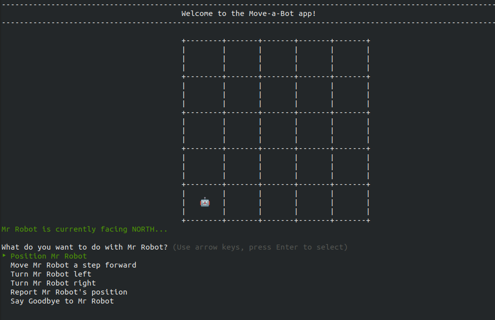

## **Toy Robot Coding Challenge**

This is an attempt at solving the toy robot challenge using [Ruby](https://github.com/ongsterr/toy-robot.git).



### **Getting Started**

1. To get started quickly, simply go to your terminal or command-line and clone the repo:

```
$ cd your_directory
$ git clone https://github.com/ongsterr/toy-robot.git
```

2. Then go into `toy-robot` and install app dependencies:

```
$ cd toy-robot
$ bundle i
```

3. Lastly, initiate the app:

```
$ ruby main.rb
```

4. Enjoy!

Note: To run test for the repo, simply:

```
$ bundle exec rspec
```
